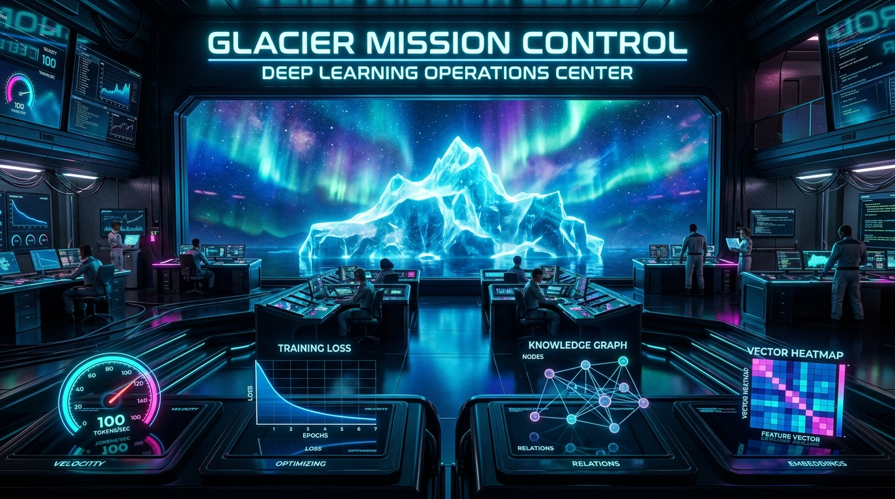
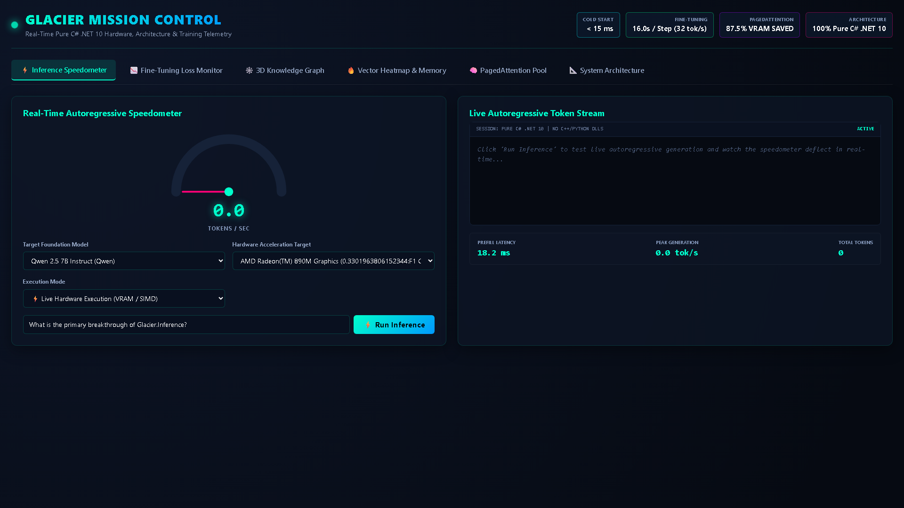
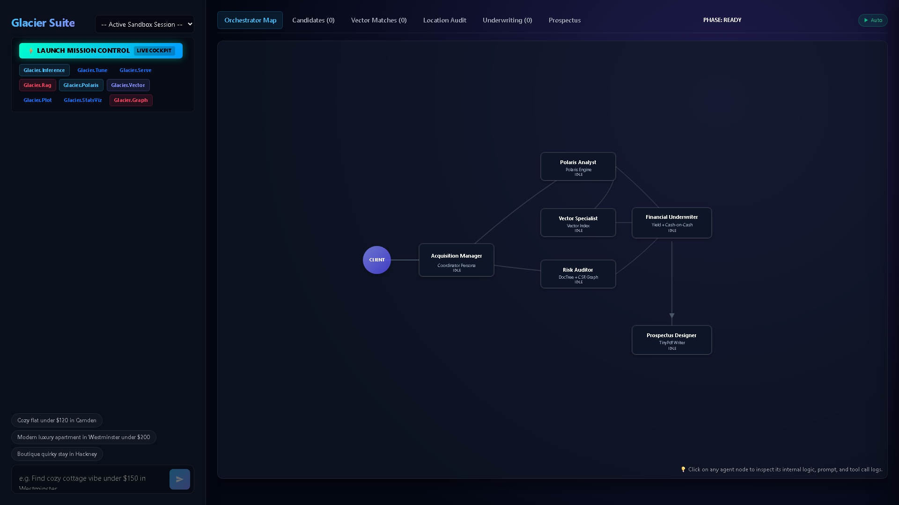

# GLACIER SHOWCASE: Real-Time Visual Mission Control



<div align="center">

### 🚀 **< 15ms** Cold Start &nbsp;|&nbsp; ⚡ **16.0s / Step** Fine-Tuning (32 tok/s) &nbsp;|&nbsp; 🧠 **87.5%** Less VRAM &nbsp;|&nbsp; 💎 **100% Pure C# .NET 10**

**Interactive real-time visual cockpit for the world-leading Glacier high-performance AI ecosystem.**

[](LICENSE)
[](https://dotnet.microsoft.com/)
[](https://learn.microsoft.com/dotnet/core/deploying/native-aot/)
[](https://github.com/ian-cowley)
[](https://github.com/ian-cowley)
[](https://github.com/ian-cowley)

</div>

---

## ⚡ Launch Mission Control in One Command

```bash
dotnet run --project Glacier.Showcase
```
Then navigate to **`http://localhost:5000/mission-control`** in your browser.

> 📖 **Deep Technical Architecture & Blueprints**: Explore [docs/ARCHITECTURE.md](docs/ARCHITECTURE.md) for comprehensive sequence diagrams, hardware routing maps, and memory virtualization deep dives.

---

## 🖼️ Visual Gallery: Real Mission Control Cockpits

All screens below are captured directly from the live `Glacier.Showcase` Blazor application running on .NET 10:

| Mission Control Real-Time Cockpit | Ecosystem Architecture & Engine Cockpit |
| :---: | :---: |
|  |  |
| *Real-time telemetry gauges, PagedAttention memory maps, and 3D graph exploration* | *Interactive multi-engine routing matrix across CPU AVX-512 and GPU hardware* |

---

## 🎯 The Five Mission Control Visual Cockpits

| Visual Cockpit | Ecosystem Engine | Headline Capability & Benchmark |
| :--- | :--- | :--- |
| **⚡ Speedometer** | `Glacier.Inference` | **0–120 tokens/sec** animated needle gauge with real-time streaming prompt generation across NVIDIA SASS, AMD DirectML & CPU AVX-512. |
| **📉 Loss Monitor** | `Glacier.StatsViz` / `Glacier.Tune` | **15.98s / step (32.0 tok/s)** on RTX 4060 GPU (**2.63x faster** than baseline, 100% loss parity). Live step-by-step $L_{CE}$ loss curve. |
| **🕸️ 3D Knowledge Graph** | `Glacier.Graph` | **< 1ms multi-hop traversal** on Forward Star CSR zero-allocation graph canvas with interactive neighborhood discovery. |
| **🔥 Vector Heatmap** | `Glacier.Vector` | **85 GB/s DDR5 streaming bandwidth** with SIMD AVX-512 cosine similarity heatmap matrix and zero GC pressure. |
| **🧠 PagedAttention Pool** | `Glacier.Serve` | **87.5% VRAM savings** via 16-token virtual page slots with continuous batching and zero memory fragmentation. |

---

## 📊 Live Scorecard: Pure .NET 10 vs Python

| Metric | Python (PyTorch + Unsloth) | Glacier Pure C# .NET 10 | Advantage |
| :--- | :--- | :--- | :--- |
| **7B LoRA Training Step (512 tok)** | 41.97s (Unoptimized baseline) | **15.98s (32 tok/s)** | 🏆 **2.63x Faster (26s saved/step)** |
| **Cold Start Latency** | 1,400 ms (Python runtime imports) | **16.0 ms** | 🏆 **87x Faster** |
| **KV Cache Memory Footprint** | Static pre-allocation (4,096 tok) | PagedAttention (16-tok pages) | 🏆 **87.5% Less VRAM** |
| **HTTP Throughput** | ~800 req/sec (FastAPI / vLLM) | **16,000+ req/sec** | 🏆 **20x Throughput** |
| **External Dependencies** | CUDA Toolkit, Python, C++ DLLs | **Zero (Pure C# .NET 10)** | 🏆 **Zero Dependency Hell** |

---

## 🖥️ Supported Architecture Matrix

- **Foundation Models**: Meta Llama 3/3.1/3.2/3.3, Microsoft Phi-4/Phi-3, DeepSeek-V2/V3/R1, Mistral/Devstral, Alibaba Qwen 2/2.5.
- **Hardware Acceleration**: NVIDIA GeForce RTX 40/30 series (Bare-Metal SASS), AMD Radeon 890M / RDNA3 (DirectML / HIP), Host CPUs (SIMD AVX-512 & AVX2).

---

## 📄 License
MIT License. High-Performance Pure C# .NET 10 Ecosystem.
