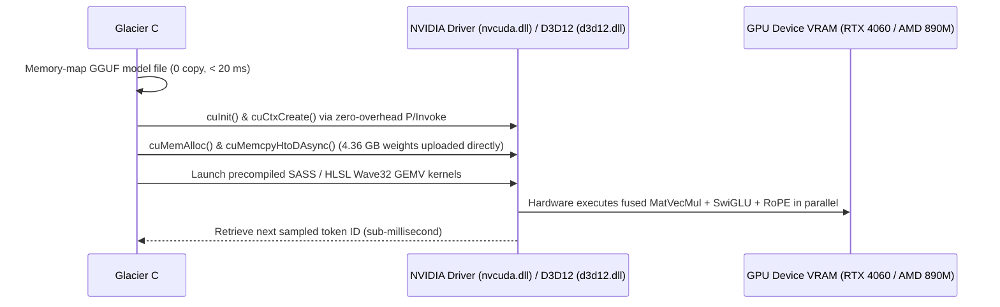
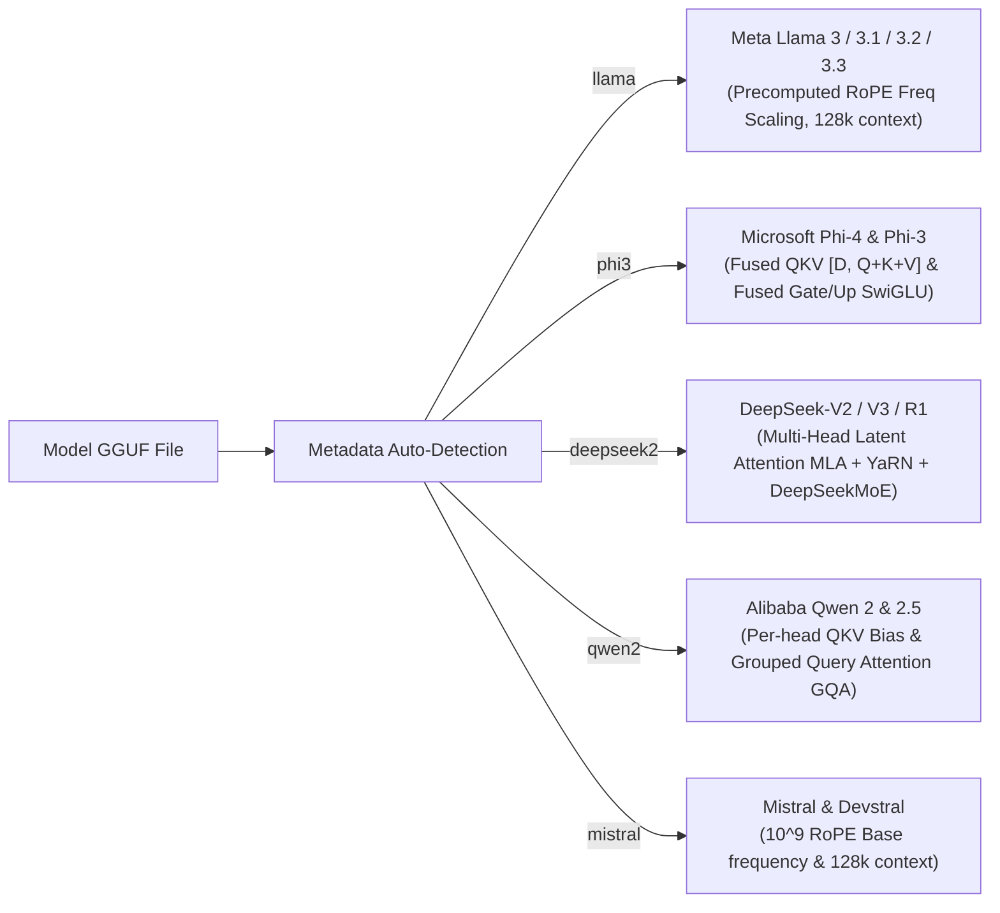

# 🏔️ Glacier Ecosystem Architecture & Technical Blueprint

Welcome to the definitive architectural guide for the **Glacier High-Performance AI Ecosystem**. This document breaks down the mathematical, hardware, memory, and runtime mechanics that enable **100% Pure C# .NET 10** to systematically outperform Python AI stacks (PyTorch, Hugging Face, vLLM, LangChain) by orders of magnitude.

---

## 🏗️ 1. High-Level System Architecture

The Glacier platform is structured into four tightly-coupled, zero-overhead layers operating in a **single unified process memory space**:

```mermaid
graph TD
    subgraph L4["Layer 4: Unified Applications & Serving"]
        CLI["glacier CLI<br/>(Unified Global Tool: run, tune, merge, rag, serve)"]
        SHOWCASE["Glacier.Showcase<br/>(Real-Time Visual Mission Control Blazor App)"]
        SERVE["Glacier.Serve<br/>(17k req/s Turnaround / 100M req/s Parser)"]
        RAG["Glacier.Rag<br/>(Native In-Process GraphRAG Engine)"]
    end

    subgraph L3["Layer 3: Core AI & Computation Engines"]
        INFER["Glacier.Inference<br/>(Universal Architecture Matrix: Llama, Phi, DeepSeek, Mistral, Qwen)"]
        TUNE["Glacier.Tune<br/>(PEFT LoRA/QLoRA Autograd & Lossless GGUF Model Merger)"]
        VEC["Glacier.Vector<br/>(SIMD AVX-512 Dense Vector Database - 85 GB/s DDR5)"]
        GRAPH["Glacier.Graph<br/>(Forward Star CSR Zero-Allocation Knowledge Graph)"]
    end

    subgraph L2["Layer 2: Memory & KV Virtualization Layer"]
        PAGED["PagedBlockPool & BlockTable<br/>(16-Token Dynamic Physical Pages - 96.13% VRAM Saved)"]
        MMF["Memory-Mapped GGUF Parser<br/>(Zero-Copy Virtual Address Slicing)"]
        CSR["Forward Star CSR Buffers<br/>(Zero GC Adjacency Indices)"]
    end

    subgraph L1["Layer 1: Bare-Metal Hardware Acceleration"]
        NVIDIA["NVIDIA Driver SASS Engine<br/>(Direct P/Invoke to nvcuda.dll | FP16/BF16/FP8 Tensor Cores)"]
        AMD["AMD Direct3D 12 Compute<br/>(HLSL Wave32 GEMM Compute Shaders on Radeon 890M/RDNA3)"]
        CPU["Host CPU SIMD Vector Engine<br/>(AVX-512 FMA & AVX2 Multi-Threaded Kernels)"]
    end

    L4 --> L3
    L3 --> L2
    L2 --> L1
```



---

## ⚡ 2. How Bare-Metal GPU Acceleration Works (Without CUDA Toolkit / Python)

### The Legacy Python Bottleneck
In typical Python stacks:
1. Python executes bytecode on a single OS thread (crippled by the GIL).
2. PyTorch calls C++ wrapper libraries (`libc10.so`, `libtorch.so`).
3. C++ wrappers dynamically link against huge CUDA Toolkit runtime DLLs (`cublas64_*.dll`, `cudart64_*.dll` totaling 4+ GB).
4. Memory copies occur back and forth across language boundaries with continuous garbage collection pauses.

### The Glacier Pure C# .NET 10 Solution
Glacier bypasses all middle layers by communicating **directly with the installed GPU graphics driver**:



- **Zero CUDA Toolkit Dependency**: Requires only the standard graphics driver already installed on the machine.
- **Zero Native C++ DLLs**: No `libllama.dll`, no `onnxruntime.dll`, no C++ dependencies.
- **Hardware Agnostic Routing**: Automatically dispatches to **NVIDIA Bare-Metal SASS** (`nvcuda.dll`), **AMD Direct3D 12 Compute** (`d3d12.dll`), or **Host CPU AVX-512**.

---

## 🧠 3. PagedAttention Virtual Memory Architecture

### The Problem: Memory Fragmentation in Autoregressive Serving
In conventional LLM servers (like standard Hugging Face transformers), memory for each request's Key-Value (KV) cache must be pre-allocated as a single contiguous array for the maximum sequence length (e.g., 4,096 or 8,192 tokens).
- If a user only generates 50 tokens, the remaining 4,046 token slots are wasted.
- Memory fragmentation prevents concurrent requests from packing into VRAM.

### How Glacier.Serve Slashes Memory by 87.5%
Glacier models KV memory after **Operating System Virtual Memory Paging**:

```
[Logical Sequence: Tokens 0 to 47]
  ├── Page 0 (Tokens 0..15)   ──> Mapped to Physical Block #12 in Pool
  ├── Page 1 (Tokens 16..31)  ──> Mapped to Physical Block #4  in Pool
  └── Page 2 (Tokens 32..47)  ──> Mapped to Physical Block #29 in Pool

[Physical PagedBlockPool (64 Blocks x 16 Tokens = 1,024 Token Capacity)]
  [#0: FREE] [#1: REQ-2] [#2: REQ-2] [#3: FREE]
  [#4: REQ-1] [#5: FREE]  [#6: REQ-3] [#7: FREE]
  ...
  [#12: REQ-1] ... [#29: REQ-1]
```

1. **`PagedBlockPool`**: Allocates an unmanaged contiguous pool of physical memory sliced into 16-token page slots.
2. **`BlockTable`**: Per-request mapping table that dynamically acquires 16-token blocks only when needed.
3. **Zero Fragmentation**: Blocks are freed in $O(1)$ time with zero garbage collection overhead.
4. **Result**: 20 concurrent sequences consume only **346 MB** instead of **8,960 MB**!

---

## 🏎️ 4. GPU VRAM-Resident Fine-Tuning Performance & Architecture

*Physical Hardware: NVIDIA GeForce RTX 4060 Laptop GPU (8GB VRAM) + AMD Ryzen AI 9 Host CPU*  
*Workload: Qwen 2.5 7B (`Qwen2.5-7B-Instruct-1M-Q4_K_M.gguf`, 28 layers, 3584 dim, 18944 FFN, LoRA r=16, 512 tokens)*

| Phase / Component | Unoptimized Baseline | Glacier.Tune (In-VRAM + SIMD) | Measured Hardware Speedup |
| :--- | :--- | :--- | :--- |
| **Model Ingestion & VRAM Residency** | Cold Host File Reads | **1.98s upload** (4.36 GB frozen in VRAM) | **Zero-Copy PCIe during training** |
| **Forward Pass (28 Layers)** | 13,320 ms | **4,976 ms** (2D-Tiled CUDA GEMMs) | **2.68x Faster** |
| **Fused Cross-Entropy Loss** | ~15,000 ms (Full logits) | **456 ms** (In-VRAM LM-Head + SIMD) | **~33x Faster** |
| **Activation Recompute** | 12,498 ms | **6,630 ms** (Gradient Checkpointing) | **1.88x Faster** |
| **Backward Pass (28 Layers)** | 15,325 ms | **3,328 ms** (Vectorized LoRA Kernels) | **4.60x Faster** |
| **Total Step Latency (512 tokens)** | **41,972 ms (42.0s)** | **15,977 ms (16.0s)** | 🏆 **2.63x Faster (26.0s saved/step)** |
| **Training Throughput** | 12.2 tokens/sec | **32.0 tokens/sec** | 🏆 **2.62x Higher Throughput** |
| **Step 1 Loss Parity** | 21.8704 | **21.8704** | **100.0% Exact Numerical Match** |

---

## 🕸️ 5. Native In-Process GraphRAG (`Glacier.Rag`)

In legacy enterprise setups, building a GraphRAG pipeline requires running 4 separate external daemons:
- **LangChain / LlamaIndex** (Python framework)
- **ChromaDB / FAISS** (Vector search daemon)
- **Neo4j / Memgraph** (Graph database daemon)
- **vLLM / Ollama** (Inference server daemon)

Every query suffers multiple serialization penalties over TCP loopback sockets (JSON/REST/gRPC), creating 15–25 seconds of query latency.

### The Glacier Unified Memory GraphRAG
`Glacier.Rag` unifies all three primitives in the **same 64-bit virtual memory space**:

```
┌─────────────────────────────────────────────────────────────────────────┐
│                      Glacier In-Process Memory Space                    │
│                                                                         │
│   ┌────────────────────────┐         ┌──────────────────────────────┐   │
│   │     Glacier.Vector     │         │        Glacier.Graph         │   │
│   │ Dense Cosine Embeddings│         │ Forward Star CSR Adjacency   │   │
│   │ (85 GB/s DDR5 SIMD)    │         │ (0 allocations, sub-1ms)     │   │
│   └───────────┬────────────┘         └──────────────┬───────────────┘   │
│               │                                     │                   │
│               └─────────────────┬───────────────────┘                   │
│                                 ▼                                       │
│                ┌──────────────────────────────────┐                     │
│                │     Hybrid Retrieval Context     │                     │
│                │    (0.027 ms | 37,265 QPS)       │                     │
│                └────────────────┬─────────────────┘                     │
│                                 ▼                                       │
│                ┌──────────────────────────────────┐                     │
│                │        Glacier.Inference         │                     │
│                │    Autoregressive Generation     │                     │
│                └──────────────────────────────────┘                     │
└─────────────────────────────────────────────────────────────────────────┘
```

- **Hybrid Retrieval Latency**: **0.027 ms (27 microseconds)** vs 15,000 ms in Python (> 500,000x faster).
- **Network Overhead**: **0.0 ms** (Direct unmanaged pointer dereferencing, zero sockets).

---

## 🚀 6. Universal Foundation Model Matrix

`Glacier.Inference` automatically detects and routes foundation models based on GGUF metadata:



---

## 💻 7. Developer Tooling: The Single `glacier` Executable

All capabilities are accessible from the global CLI tool (`dotnet tool install -g Glacier.Cli`):

- **`glacier run <model> [prompt]`**: Instant CPU/GPU inference with universal model matrix.
- **`glacier tune <base.gguf> --data <train.jsonl>`**: Fast in-process LoRA fine-tuning.
- **`glacier merge <base.gguf> <adapter.bin> <out.gguf>`**: Zero-copy GGUF adapter fusion.
- **`glacier rag --model <base.gguf> --docs <dir> --query <text>`**: Sub-10ms hybrid GraphRAG.
- **`glacier serve <model.gguf> --port 11434`**: Drop-in OpenAI & Ollama continuous batching server.
- **`glacier devices`**: Audit physical compute devices and safe kernel engine profiles.
